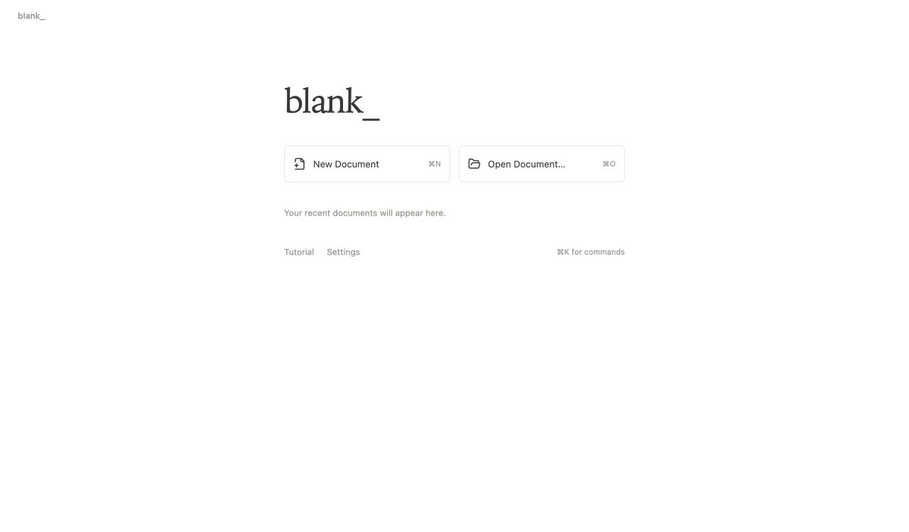

# blank_

**Made using AI (OpenAI Codex). Open source under the [MIT license](LICENSE).**

We couldn’t resist adding [one more Typst editor](https://days-since-last-typst-editor.samake.se).

A quiet macOS app for academic writing in [Typst](https://typst.app). Write comfortably, edit the source, and preview the typeset PDF. Your documents stay ordinary `.typ` files on your computer.



- Rich writing, Typst source editing, and PDF preview with shortcuts to switch views.
- Multi-file manuscripts, a table of contents, images, tables, and PDF export.
- Optional local Zotero citations and an MCP adapter for agents.
- Offline compilation with a bundled Typst helper and fonts.

## Build and run

Requires macOS 15+ on Apple Silicon, Xcode Command Line Tools, Node.js 22.12+ (or a compatible newer LTS), npm, and Python 3. Bootstrap installs local Go and Rust toolchains.

```sh
bash scripts/bootstrap.sh
bash scripts/build.sh
open build/bin/blank_.app
```

Start with **New Document**, open an existing `.typ` file, or try **Tutorial**. Use `⌘1` to write, `⌘2` for source, `⌘3` for preview, and `⌘K` for commands.

This is an early development build, signed ad hoc for local use. See the [guide](docs/guide.md) for setup and features and the [acceptance notes](docs/acceptance.md) for validation and remaining work. The GIF shows the same editor running in browser development mode.

## Contribute

Issues and pull requests are welcome. Run `bash scripts/check.sh` before submitting code changes. Contributions use the [MIT license](LICENSE); third-party dependencies retain their own licenses.
