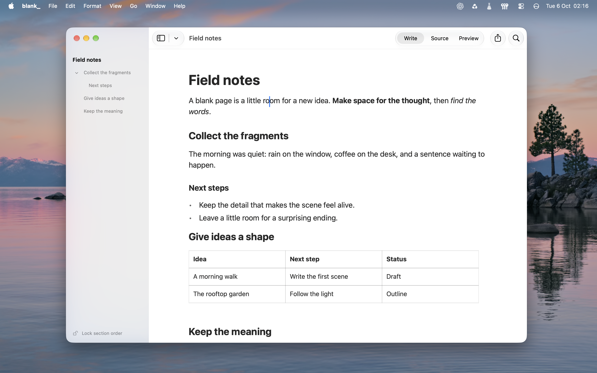

# blank_

A quiet native macOS editor for [Typst](https://typst.app), built with SwiftUI and AppKit. Your documents stay ordinary local `.typ` projects.



- **Write, Source and Preview** — native rich text, exact source editing and typeset PDFs; shared undo and formatted clipboard.
- **Structured writing** — headings, lists, tables, figures, links, footnotes, formatted citations/bibliographies and collapsible code blocks.
- **Navigation** — a movable outline, thumbnails, contact sheet and live search across project files.
- **Templates** — Standard, Thesis, Paper, Letter A4, Book and Slides (16:9 projector); preview, create, duplicate, edit or delete your own.
- **Native document tools** — PDF export/sharing, Zotero integration, statistics, recovery and macOS save/move controls.

Citation search filters while you type. References already cited in the project appear first with an **Already cited** marker and can be reused without contacting Zotero. Inline citations have a subtle gray background; click to edit their reference, locator and display. Rich or computed citations retain an exact-source editor. The document’s style controls formatting; Citation display chooses a standard citation, one within a sentence, author only or year only. Write shows Typst’s formatted citations and bibliography, while Source retains their exact expressions. New insertions consistently use `#cite`.

Slash commands also appear in the macOS **Format** (paragraph styles) and **Insert** (objects) menus. **Code** creates an empty collapsible Typst source block with the caret inside. Write colors its Typst syntax, keeps Return inside the block with indentation, and protects its outer `#{` / `}` from partial edits; select the whole block to delete it. Source permits editing every delimiter. Code input disables prose substitutions and restores them when returning to prose.

Cross-reference insertion offers existing literal labels from the project, including unsaved edits, and accepts custom targets. Computed and package-created labels can be entered by name. New references use explicit `#ref` calls so label names and adjacent prose remain separate.

Write gives literal labels such as `<intro>` a subtle gray background. They stay ordinary editable text and copy with their existing source; the background is display-only. Find temporarily highlights matches in yellow. Source keeps its existing syntax styling.

Image figures with literal paths, plain captions and integer widths from 5–100% offer the insertion controls when double-clicked or edited through their block menu. Apply changes only the edited values; comments and custom options stay intact. Choose image stages a replacement until Apply, and Undo retains both image assets. **Edit source…** remains available; computed paths, rich captions and unsupported widths open the exact-source editor. Width affects the typeset PDF; Write retains its existing figure sizing.

Every Write block handle offers **Edit source…**, including prose, native tables and folded code. The sheet edits that block’s exact Typst source, preserving surrounding source and sharing Write/Source Undo. Formatting, table controls and **Edit image…** remain available.

New Document opens an empty editor. Empty writing blocks show subtle hints; headings and lists apply their formatting before typing. Backspace at the start of a heading/list removes its formatting. Delete toward an adjacent table or folded/expanded code block selects it; a second Delete removes it, and Undo restores its exact source. Deleting outward from code also selects the block instead of joining it to prose. Find templates in **File → Templates…** or Cmd-K. Try the [Field notes](examples/Field%20notes.typ) sample.

## Projects and references

**New Document** stays empty. **File → New Project…** creates a dedicated folder containing only an empty `main.typ`. Projects are ordinary Typst folders, with no entry manifest. Opening a `.typ` selects it for compilation; opening a folder uses its remembered entry or a single document that is not included/imported by another file, otherwise a native panel lets you choose. Selections are stored in the app’s data directory. A directly opened file uses its parent as the root unless it belongs to a folder previously opened as a project.

Includes and imports keep their names and structure. Relative paths resolve from the referring file; `/…` resolves from the project root. Adding a literal chapter include creates its empty `.typ` automatically. Existing missing/unreadable files are reported rather than overwritten. Packages must already be cached or vendored in `packages/`.

Zotero insertion uses the document’s declared bibliography, including external BibLaTeX `.bib` and Hayagriva `.yaml`/`.yml`. Multiple inputs offer a destination choice. The app never attaches bibliographies merely because they share a folder. Without a bibliography, the first import embeds readable BibLaTeX in the document using Typst’s `bibliography(bytes(...))` input; independent documents can share a folder without generated reference-file collisions. There is no `writer-references.json` or beta-storage migration.

Zotero item keys, library identifiers (`users/…` or `groups/…`) and the exported field list live in `x-blank-zotero-*` metadata alongside each entry. **Refresh Zotero References** is manual: it retains citation keys, changes only linked entries and keeps unrelated entries, comments, macros and custom fields. Citation insertion and refresh use canonical range history; cross-file insertion undoes the citation and bibliography together. Write uses Typst’s formatted citations/bibliographies; Source keeps the complete editable expressions. **Bibliography style** accepts standard style names or a custom CSL file.

**Convert Bibliography…** is available in Cmd-K and the File menu. Choose a bibliography input, then embedded BibLaTeX, external `.bib`, or external Hayagriva `.yaml`. Moving BibLaTeX between embedded and external storage preserves its exact text; format changes preserve Zotero linkage and keep an encoded original-source snapshot in a comment for an unchanged round trip. Citation keys, call options and styles stay intact. Existing external files are retained, new-file collisions are rejected, and conversion shares source Undo. Conversion requires direct literal paths/bytes inputs; variable or computed inputs stay editable in Source. Hayagriva-to-BibLaTeX conversion is refused when the official parser cannot recover identical reference data.

Save As preflights dependency collisions and copies literal dependencies plus files read by a background Typst evaluation. A nested entry’s literal paths are rebased; when computed paths require their original location, an ordinary `.typ` include wrapper keeps the original entry and folder structure intact. Unreached computed dependencies cannot be discovered automatically. Computed raw-byte bibliography data and package-owned bibliographies remain editable in Source but are not rewritten by Zotero. Hayagriva Zotero edits require block mappings; flow mappings/aliases still compile and remain source-editable.

Checks cover external projects, nested/root paths, embedded/external references, Zotero refresh with isolated responses, custom CSL, assets, Unicode, selection/clipboard, Undo and Save As. Compiler checks compare reference presentation with and without the metadata fields. Native checks also cover citation clicks and local edits, table-cell fields, already-cited search/reuse, menu parity, Code insertion/colors, delimiter protection, indented Return, composition and exact-source Undo. Disposable app inspection verifies the gray fields, citation controls, picker markers and native menu layout; live Zotero insertion/refresh remain unverified.

## Download

Download the last release from https://github.com/gagarine/blank_/releases (no auto-update yet)

⚠️ Releases are not notarized. If macOS blocks blank_, click **Done**, then **System Settings → Privacy & Security → Open Anyway**. Authenticate if asked, then click **Open**. [Apple’s instructions](https://support.apple.com/en-us/102445).

## Development

Requires macOS 26+, Swift 6 with a macOS 26/27 SDK, Rust 1.98.1 (pinned) and Python 3.

```sh
bash scripts/build.sh release  # omit release for debug
open build/blank_.app
bash scripts/check.sh
```

Both builds update the same app; quit and reopen after rebuilding. Checks cover the document model, compiler, native editing/files and a relocated bundle; native checks need an unlocked desktop session.

Write figures scroll with their text instead of sticking to the viewport. Block dragging keeps document-relative targets and continues scrolling while held beyond the viewport edge. Native regressions cover moves past 80 blocks, exact Unicode Undo and figure removal/restoration across scrolls; disposable app checks also verify image scrolling and block placement visually.

The Cargo workspace shares a lockfile/cache for the in-process parser and separate PDF compiler, both using Typst 0.15.1. See [AGENTS.md](AGENTS.md) for architecture and build conventions.

[CI](.github/workflows/build-macos.yml) checks pushes and pull requests on macOS 26/27. Publishing a `vX.Y.Z` release attaches the Apple Silicon app and checksum after both builds pass. Apps are ad-hoc signed; Intel support is unverified.

## Remaining work

- Rich controls for editing existing links, footnotes, grouped/complex citations and custom figures; PDF-page selection and broader image-format validation.
- Zotero group discovery and citation-picker keyboard navigation. Custom citation show rules and note-style footnote presentation in Write remain unverified.
- Continuous editing across included files and repeated includes.
- Settings synchronization, disjoint external-change merging and broader recovery checks.
- Large-table and Source performance; long-document memory/latency measurements.
- Opt-in MCP/agent access with revision-checked transactions and selective undo.

Live Zotero insertion/refresh, physical IME candidates, bidirectional editing, VoiceOver and Writing Tools remain unverified. An empty-editor release run measured 0.14% of one CPU core and 14.5 MiB RSS; compiler memory was excluded. Use `--measure` with disposable `BLANK_DATA_DIR` data.

[MIT](LICENSE) · Built with OpenAI Codex.
